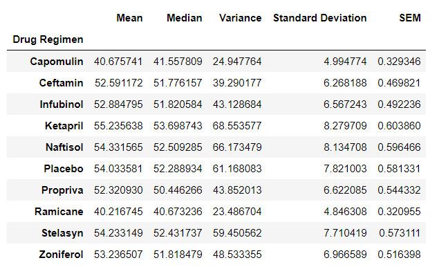
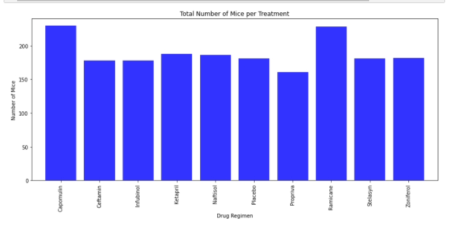
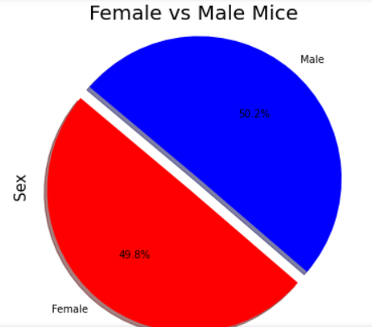
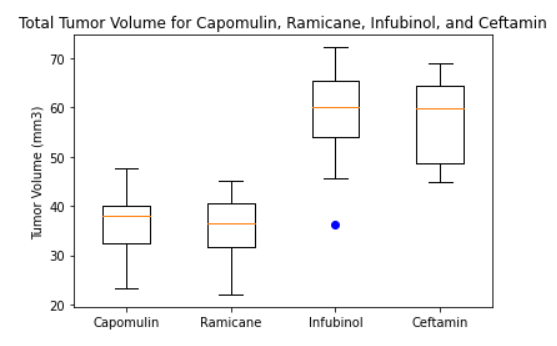
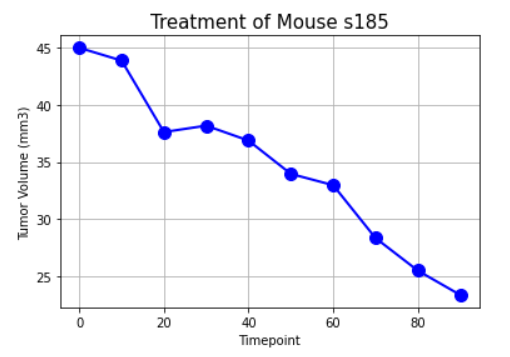
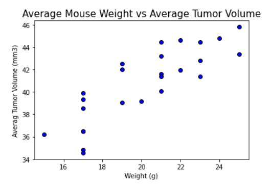
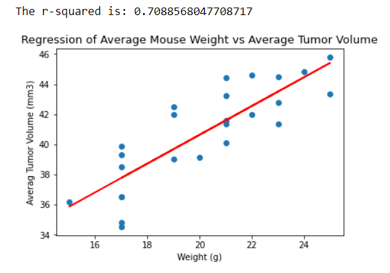

# Data Manipulation, Analysis & Plotting - Pymaceuticals - Matplotlib

- - -

I analyzed data from Pymaceuticals' most recent animal study in order to create a technical report and top-level summary of the study results. Matplotlib was used to plot the data.

- - -

# Background

Pymaceuticals specializes in anti-cancer pharmaceuticals. It began screening for potential treatments for squamous cell carcinoma (SCC), a commonly occurring form of skin cancer.

In their most recent animal study, 249 mice identified with SCC tumor growth were treated through a variety of drug regimens. Over the course of 45 days, tumor development was observed and measured. The purpose of this study was to compare the performance of Pymaceuticals' drug of interest, Capomulin, versus the other treatment regimens.

# Data Analysis Observations

1. The two drug regimens that seem to have made a positive effect in the treatment of the tumor on mice had a very similar average of the total tumor volume. Capomulin being at 40.68 and Ramicane being at 40.22.
2. There was more mice for the two drug regimens: Capomulin and Ramicane that seemed most effective.
3. The total count of mice per gender was almost 50/50. 124 female mice and 125 male mice.
4. Infubinol seemed to be the only one with an outlier.
5. The longer in treatment the smaller the tumor volumen.
6. Mouse weight correlated strongly with average tumor volume.

# What I did:

* Before beginning the analysis, checked the data for any mouse ID with duplicate time points, and removed any data associated with that mouse ID.

* Used the cleaned data for the remaining steps.

* Generated a summary statistics table consisting of the mean, median, variance, standard deviation, and SEM of the tumor volume for each drug regimen.

* Generated a bar plot using both Pandas's `DataFrame.plot()` and Matplotlib's `pyplot` that shows  the number of total mice for each treatment regimen throughout the course of the study.

* Generated a pie plot using both Pandas's `DataFrame.plot()` and Matplotlib's `pyplot` that shows the distribution of female or male mice in the study.

* Calculated the final tumor volume of each mouse across four of the most promising treatment regimens: Capomulin, Ramicane, Infubinol, and Ceftamin. Calculated the quartiles and IQR and quantitatively determined if there are any potential outliers across all four treatment regimens.

* Using Matplotlib, I generated a box and whisker plot of the final tumor volume for all four treatment regimens and highlighted any potential outliers in the plot by changing their color and style.

* Selected a mouse that was treated with Capomulin and generated a line plot of tumor volume vs. time point for that mouse.

* Generated a scatter plot of mouse weight vs. average tumor volume for the Capomulin treatment regimen.

* Calculated the correlation coefficient and linear regression model between mouse weight and average tumor volume for the Capomulin treatment. Plotted the linear regression model on top of the previous scatter plot.

- - -
The data is provided by UCSD Extension: Data Science and Visualization Bootcamp.
- - -

Contact:

Email: arcebri1@gmail.com